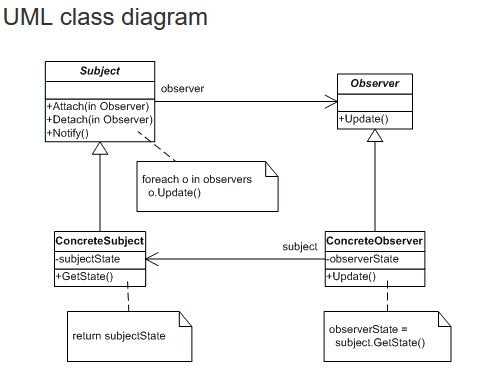

# Design Pattern #

## Observer Pattern ##

It is extensibely used in .NET. GUI controls: events such as OnClick, Data binding of controls: GridView control in ASP.NET web forms can be lined to its item template/source.
Take a look at this UML class diagram.

e.g `Subject` -> Stock, `ConcreteSubject` -> IBMStock, `Observer` -> IInvestor, `ConcreteObserver` -> ABCInvestorCorp. `Subject` can be also called _Observerable_

It is helpful to think this way: as in newspaper subscription. If you wish to get news from particular news organization. If you subscribe then they will sent you news. You will have ability to unsubscribe if you no longer wish to get news from them.

Likewise, `Subject` will keep track of all the `observer`, will have ability to notify all of them when new event happens. It will have a way to remove `observer`.

### DotNet `IObserver<T>` and `IObservable<T>` ###

DotNet implement observer pattern by using interfaces `IObserver<T>`, `IObservable<T>`. `IObserver` interface force to class to implement three things.

+ `OnCompleted`: signals there will be no more changes to the subject. and it is safe to notify
+ `OnError`: if you run into error while processing the subject.
+ `OnNext`: when getting the next value of the subject

`IObservable<T>` will have subscribe method, registration of obserers and returns an IDisposable object.

#### Links ####

+ [dotnetcodr](https://dotnetcodr.com/2013/08/01/design-patterns-and-practices-in-net-the-observer-pattern/)
+ [wikipedia, good succient C# example](https://en.wikipedia.org/wiki/Observer_pattern)
+ [dofactory, good introductory article](https://www.dofactory.com/net/observer-design-pattern)
